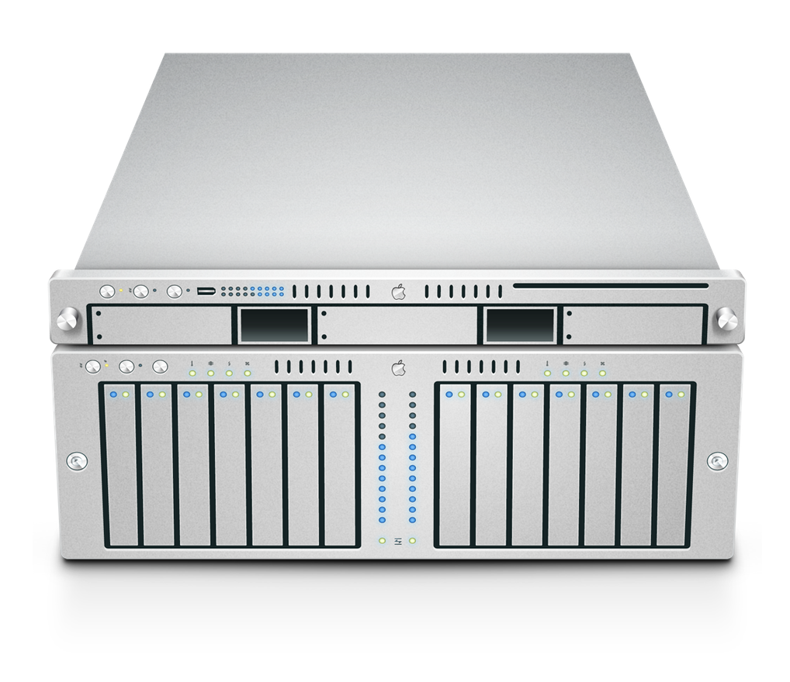

# Serve TimeMachine Drives from Linux
You get a really cool Xserve Drive Logo if you do this correctly.



## Run Down:
a. could not get ext4 format to work

b. could not get samba to work

c. easiest to format drive with hfs+ on mac osx 

d. began with missing partitions on hfs+ hdd (data still intact)

e. My device was located at '/dev/sda'.  I mounted my hfs+ hdd to '/media/hfs/2tb', you can mount elsewhere.

## Mount your hfs+ hdd
Example:
```shell
sudo apt-get install hfsplus hfsutils hfsprogs
sudo mount -t hfsplus -o force,rw /dev/sda1 /media/hfs/2tb
```

## Add the hfs+ hdd to '/etc/fstab'
* https://raspberrypi.stackexchange.com/questions/29087/adding-hfsplus-file-system-to-fstab
Enable mount persistent across reboots. 

Example:
```text
# /etc/fstab
UUID=fefc150b-2d57-3a85-9a41-d6b5d97de670 /media/hfs/2tb hfsplus force,rw 0 0
```

## Backing Up broken GUID partition table
Fixing a currupted drive partition map was nothing but fun.  Eventually, I mounted the raw drive /dev/sda and was still able to view the files.  Since I could'nt fix it I just backed up the drive, prepating it for reformation.
* VCP will show you the progress of your copy. (https://github.com/alexfrederiksen/vcp)

Install VCP
```shell
git clone https://github.com/alexfrederiksen/vcp.git
cd vcp
sudo  ./install.sh
```

Go to the directory you wish to copy and run:
```shell
vcp <destination>
```

Magic should now be working, and the drive will be backing up.

## Reformat hdd on MacOSX to hfs+

## Install AFP for file sharing

* Ubuntu AFP setup
https://fixpress.org/afp-ubuntu/
* AFP TimeMachine install
https://gregology.net/2018/09/raspberry-pi-time-machine/

## Install  netatalk  and  avahi
```shell
sudo apt-get install netatalk
sudo apt-get install avahi-daemon
sudo apt-get install libnss-mdns
```

## Ownership for success
```shell
sudo chmod 1777 -r /media/hdd/timemachine
```

## Configure netatalk -  WARNING NOT TESTED
Name your netatalk server
```shell
# /etc/default/netatalk
ATALK_NAME=vault
CNID_METAD_RUN=yes
AFPD_RUN=yes
```

## Edit the main AFP/netatalk config
```shell
# /etc/netatalk/afp.conf
[Global]
  mimic model = TimeCapsule6,106

[Time Machine]
  path = /media/hfs/2tb
  time machine = yes
```

## Append the 'AppleVolumes.default' file
Example:
```text
# /etc/netatalk/AppleVolumes.default
# The line below sets some DEFAULT, starting with Netatalk 2.1.
:DEFAULT: options:upriv,usedots

# By default all users have access to their home directories.
#~/                     "Home Directory"
/media/hfs/2tb "TimeMachine" allow:j,odroid,root cnidscheme:dbd options:tm
# End of File
```

##  edit the /etc/nsswitch.conf
```shell
hosts:          files mdns4_minimal [NOTFOUND=return] dns mdns4 mdns
```

## Restart avahi-daemon and netatalk
```shell
sudo systemctl restart avahi-daemon
sudo systemctl restart netatalk
```

## Connect with MACOSX
Use the servers login credentials
```text
afp://<server-url>
```


